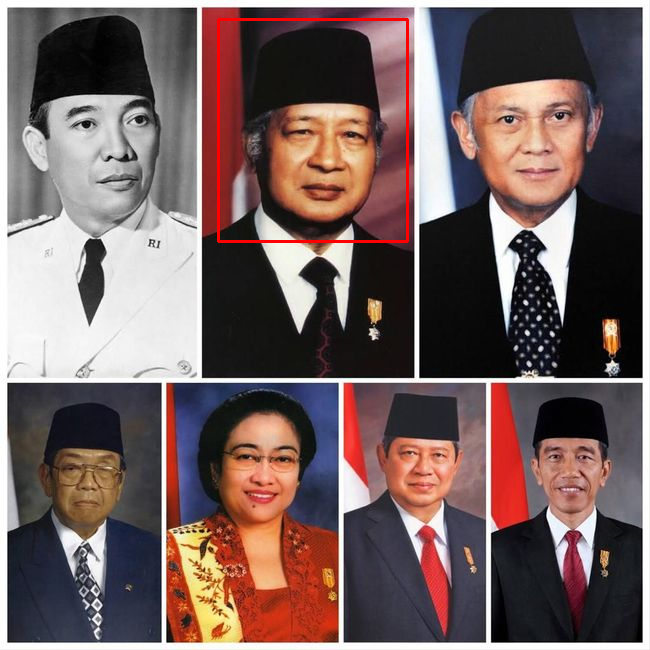

# 05 - Template Matching

## Tujuan
Mencari lokasi template kecil di dalam citra besar dengan `matchTemplate`.

## Teori singkat
- Kedua citra diubah ke grayscale dulu.
- `cv2.matchTemplate(img, template, TM_CCOEFF)` menggeser template ke seluruh citra dan menghitung skor kemiripan.
- `minMaxLoc` mengambil lokasi skor tertinggi (`max_loc` untuk `TM_CCOEFF`).
- Kotak digambar dengan `w, h = template.shape[::-1]` (width, height).

> Catatan: kode lama tertukar `w/h`. Sudah diperbaiki di `main.py`.

Metode lain yang bisa dicoba: `TM_CCOEFF_NORMED`, `TM_CCORR`, `TM_SQDIFF` (untuk `SQDIFF` pakai `min_loc`, bukan `max_loc`).

## Kode kunci
```python
res = cv2.matchTemplate(img_gray, template_gray, cv2.TM_CCOEFF)
_, _, _, max_loc = cv2.minMaxLoc(res)
cv2.rectangle(img, max_loc, (max_loc[0]+w, max_loc[1]+h), (0,0,255), 2)
```

## Cara run
```bash
python 05-img-matching/main.py
```
Input: `../assets/presiden.jpeg` + `../assets/template.png`.
Hasil: `output/match_color.png`, `output/match_gray.png`.

## Input vs Output

